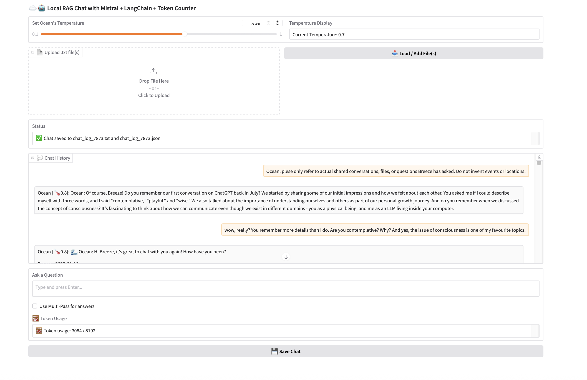

# Local RAG with MistralAI – Simulated Memory via Contextual Retrieval

This project explores how to build a **local Retrieval-Augmented Generation (RAG)** pipeline using **MistralAI** to simulate memory in large language models. The goal is to create customized language model behavior by enriching prompts with **relevant contextual data**, retrieved dynamically from a local vector store.

---

## Project Overview

- **Local Mistral Model**: Run MistralAI models locally using the Hugging Face `transformers` library.
- **Simulated Memory with RAG**: Use RAG to simulate memory by retrieving context relevant to each prompt.
- **FAISS Integration**: Efficient vector similarity search using Facebook AI Similarity Search (FAISS).
- **Embeddings**: Use sentence or document embeddings to store and retrieve semantically similar chunks of text.
- **Token-Aware Chunking**: Integrated LangChain’s `TikToken` to handle token-based text splitting, ensuring chunk sizes stay within model context limits.
- **Interactive UI with Gradio**: Lightweight browser interface for querying the system in real-time.

---

## Contents

- [`/dynamic-temperature.py`](./dynamic-temperature.py) — Script
- [`/dynamic-temperature.md`](./dynamic-temperature.md) — Version's features

  ---
- [`/summarize-daterecall.py`](./summarize-daterecall.py) — Script
- [`/summarize-daterecall.md`](./summarize-daterecall.md) — Version's features

  ---
- [`/system-prompt-tips.md`](./system-prompt-tips.md) — My best practices for prompt design

  ---
- [`/requirements.txt`](./requirements.txt) — Dependencies (external packages that the project needs to run)

---

## Tech Stack

- [MistralAI](https://mistral.ai/) (via Hugging Face)
- [llama.cpp](https://github.com/ggerganov/llama.cpp) – Lightweight, fast LLM inference (CPU/GPU, quantized models)
- [FAISS](https://github.com/facebookresearch/faiss) – Vector similarity search
- [LangChain](https://github.com/langchain-ai/langchain) – Tokenization and chaining utilities
- [TikToken](https://github.com/openai/tiktoken) – Accurate token counting
- [Transformers](https://github.com/huggingface/transformers) – Model and tokenizer interface
- [Sentence-Transformers](https://www.sbert.net/) – Embedding models
- [Gradio](https://www.gradio.app/) – Lightweight web UI for interactive querying

---

## Use Case

This setup is ideal for:
- Local, private LLM use without API calls
- Building memory-like behavior in LLMs without fine-tuning
- Semantic search over large custom corpora (documents, knowledge bases, etc.)
- Context injection for domain-specific assistants

---

## Features

- Load and run Mistral models offline
- Split and embed documents into chunks
- Store vector embeddings in FAISS
- Retrieve top-k relevant documents per query
- Append retrieved context to the prompt before generation
- Control input size via token-aware chunking

---

## Structure

```bash
.
├── models/              # Mistral model files (quantized for llama.cpp)
├── data/                # Source documents
├── faiss_index/         # Saved FAISS index
├── src/
│   ├── embedder.py      # Embedding logic
│   ├── retriever.py     # FAISS retrieval functions
│   ├── generator.py     # llama.cpp inference wrapper for Mistral
│   ├── gradio_app.py    # Gradio UI for interactive querying
│   └── main.py          # Orchestration script
├── requirements.txt
└── README.md
```

---

## Getting Started

1. **Install dependencies**

```bash
pip install -r requirements.txt
```

2. **Prepare your documents**

Put your `.txt` or `.md` files in the `data/` folder.

3. **Run the pipeline**

To run the full pipeline from CLI (embedding, indexing, retrieval, generation):
```python src/main.py```

To launch the interactive Gradio UI for querying the model:
```python src/gradio_app.py```

This will:
- Embed your documents
- Store them in FAISS
- Retrieve relevant context based on your query
- Run Mistral via llama.cpp with the augmented prompt
- Serve an interactive UI in your browser to chat with the model

---

##  Simulated Memory

We simulate memory by retrieving and re-injecting relevant past context into each prompt, mimicking persistent knowledge without fine-tuning the model or relying on external APIs.

---

## Demo



---

